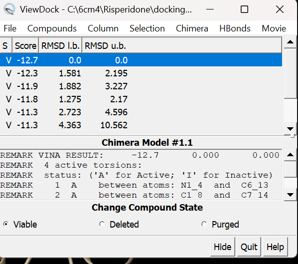

# 🧬 Molecular Docking of Risperidone with D2 Dopamine Receptor (6CM4)

_Bioinformatics project focused on understanding Risperidone–D2 receptor interactions using UCSF Chimera._

---

## 🎯 Objective  
To investigate the binding affinity and molecular interactions between Risperidone and the D2 Dopamine receptor,  
and to prepare the most stable pose for future Molecular Dynamics (MD) simulation.

---

## 🧰 Tools & Environment

| Tool | Purpose |
|------|----------|
| **UCSF Chimera** | Docking, visualization, and interaction analysis |
| **Windows 11 (HP Envy x360)** | Working environment |
| **RCSB PDB** | Protein structure source (PDB ID: 6CM4) |

---

## 🧪 Workflow Overview  

### **Step 1 – Protein Preparation**
- Retrieved **6CM4** structure from RCSB PDB  
- Removed water molecules and heteroatoms  
- Added hydrogens and Gasteiger charges  
- Exported receptor as `.mol2` and `.pdbqt`  

---

### **Step 2 – Ligand Preparation**
- Imported **Risperidone** structure  
- Performed geometry minimization  
- Assigned Gasteiger charges  
- Exported ligand as `.mol2` and `.pdbqt`  

---

### **Step 3 – Docking Execution**
- Performed molecular docking and visualization using **UCSF Chimera**  
- Focused grid box around receptor’s active site  
- Generated multiple docking poses  
- Evaluated binding affinities (kcal/mol)

---

## 📊 Results Summary

| Pose | Binding Energy (kcal/mol) | RMSD l.b. | RMSD u.b. |
|------|-----------------------------|------------|------------|
| 1 | -12.7 | 0.000 | 0.000 |
| 2 | -12.3 | 1.581 | 2.195 |
| 3 | -11.9 | 1.882 | 3.227 |

🧩 **Pose 1** achieved the strongest binding energy (-12.7 kcal/mol).  
However, due to visualization/export limitations, **Pose 2** was selected for MD simulation preparation.  

  
*Docking results showing the ranked binding poses.*

---

## 🧠 Key Insight  
The docking revealed a strong interaction between **Risperidone** and **D2 Dopamine Receptor**,  
supporting its known mechanism as an antipsychotic drug.  

---

## 📂 Repository Structure  

Docking_MD_Project/
│
├── complex_pose1.pdb # Top-ranked docking pose (Pose 1)
├── pose2.pdb # Pose selected for MD simulation
├── docking.conf # Docking configuration file
├── docking.pdbqt # Ligand docking file
├── docking.receptor.pdbqt # Receptor docking file
├── protein_preped.mol2 # Prepared protein structure
├── risperidone_minimized.mol2 # Minimized ligand structure
├── pose_ranking.png # Pose ranking screenshot
└── README.md # Project documentation

---

## 🚀 Next Phase (Work in Progress)

Preparation for Molecular Dynamics (MD) simulation using **GROMACS**, including:
- RMSD / RMSF / Rg analyses  
- SASA & H-bond evaluation  
- Free energy calculation (**MM-PBSA**)  

---

## 👩‍🔬 Author  

**Reem Mohamednur**  
Bioengineer | Research Intern  
📍 Riyadh, Saudi Arabia  

[🔗 LinkedIn](https://www.linkedin.com/in/reem-mohamednur-924a54244)  
[💻 GitHub](https://github.com/rayoomali99)  

---

> 🌟 “Understanding molecular interactions is the first step toward designing better therapies.” 🌟

